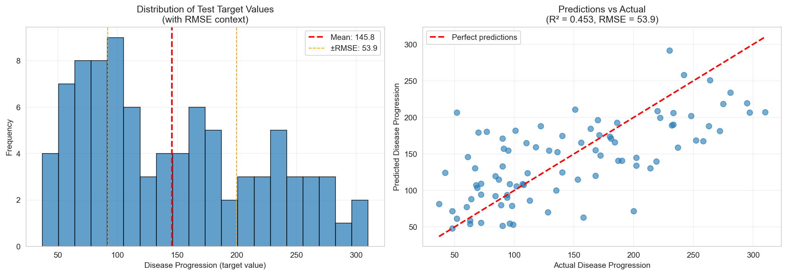
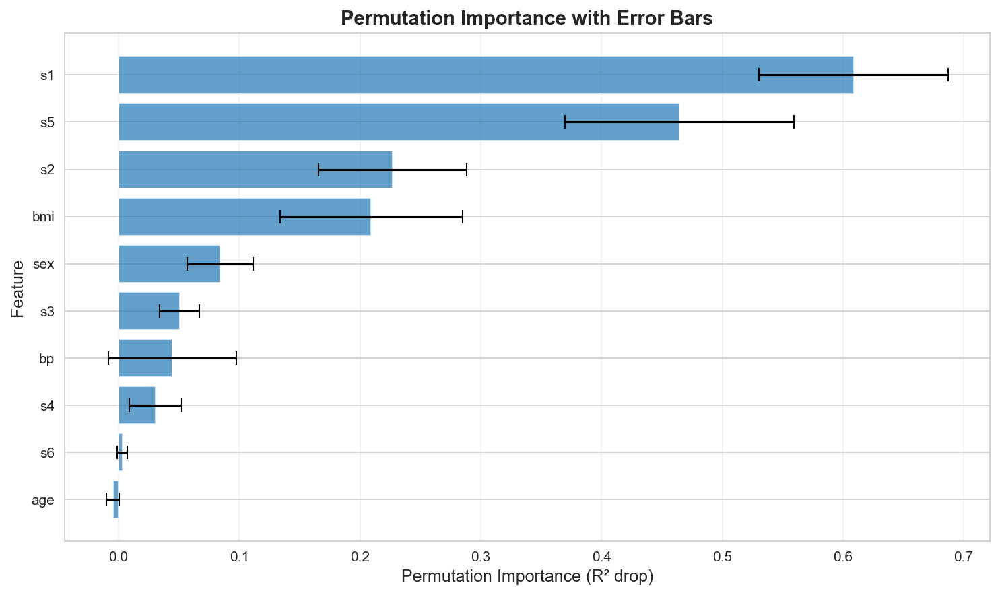
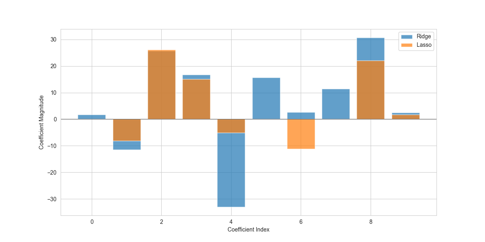
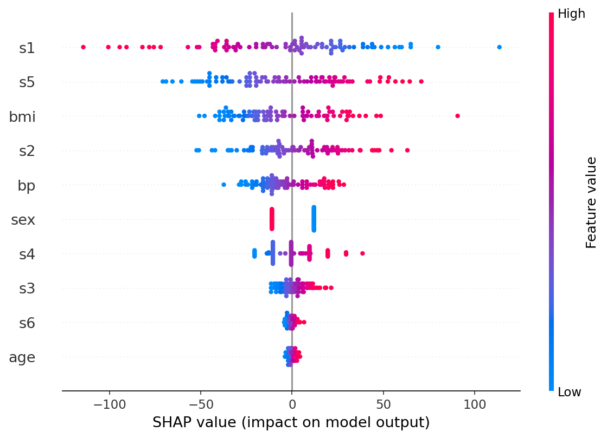
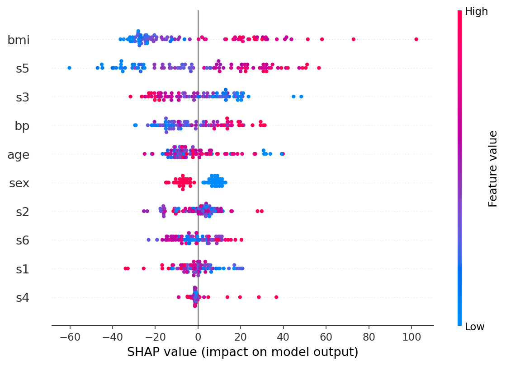
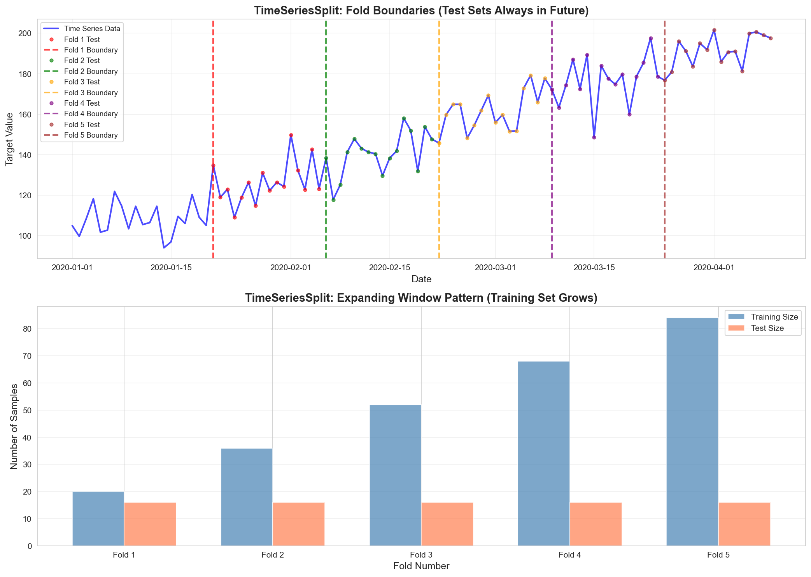

# 🥋 ML Interpretability Dojo

<div align="center">


**Mastering the Art of Understanding Your Models**

[🎯 Overview](#-the-journey) • [📚 Notebooks](#-the-path) • [🚀 Quick Start](#-getting-started) • [📊 Concepts](#-core-concepts)

</div>

---

## 👨‍💻 Author

<div align="center">

**Francisco Teixeira Barbosa**

[](https://github.com/Tuminha)
[](https://www.kaggle.com/franciscotbarbosa)
[](mailto:cisco@periospot.com)
[](https://twitter.com/cisco_research)

*Building durable intuition for model interpretability, one concept at a time*

</div>

---

## 🎯 The Journey

Imagine you've built a machine learning model that predicts patient outcomes with 95% accuracy. Impressive, right? But here's the question that keeps data scientists awake at night: **Why does it work?** What features drive the predictions? Can we trust it when it matters most?

This dojo is born from a simple realization: **understanding your model is not optional—it's essential**. Whether you're deploying in healthcare, finance, or any domain where decisions have consequences, interpretability bridges the gap between black-box predictions and actionable insights.

Through seven carefully crafted notebooks, we'll explore four pillars of model understanding:

1. **Invariance and Baselines** — Establishing what "normal" looks like
2. **Permutation Importance** — Measuring feature impact through controlled chaos
3. **Regularization (Ridge & Lasso)** — Taming complexity and selecting what matters
4. **Multicollinearity & PCA** — Diagnosing redundancy and finding structure
5. **SHAP Values** — Unpacking predictions into feature contributions
6. **Cross-Validation & Leakage** — Ensuring our insights are real, not artifacts

Each notebook is designed as a learning journey: 70% explanation, 30% guided implementation. You'll code the solutions yourself, because **understanding comes from doing**.

---

## 📚 The Path

### Notebook 00: Invariance and Baselines ✅
**The Foundation** — Before we interpret complex models, we must understand what makes a model "well-behaved." Invariance teaches us that row order shouldn't matter. Baselines teach us what "random" looks like. Together, they form the bedrock of model evaluation.

**Key Concepts:**
- Row-order invariance in tabular models
- Mean predictor and majority class baselines
- Reproducibility through random seeds

**Results:**
- Baseline Linear Regression on Diabetes Dataset:
  - **RMSE**: 53.85 (average prediction error in disease progression units)
  - **R²**: 0.4526 (explains 45.26% of variance)
  - Model demonstrates row-order invariance ✓
  - Performance beats naive baseline (mean predictor) ✓

<div align="center">



*Distribution of target values and predictions vs actual scatter plot*

</div>

### Notebook 01: Permutation Importance ✅
**Breaking the Connection** — What happens when we randomly shuffle a feature? If the model's performance barely changes, that feature carries little signal. Permutation importance quantifies this intuition, giving us a model-agnostic way to rank features by their predictive power.

**Key Concepts:**
- Feature-target association breaking
- Metric drop as importance signal
- Difference from label permutation tests

**Results:**
- Permutation importance computed on Ridge regression model (R² = 0.4528)
- **Top 3 Most Important Features**:
  1. `s1` (blood serum): 0.609 importance (R² drop when permuted)
  2. `s5` (blood serum): 0.464 importance
  3. `s2` (blood serum): 0.227 importance
- Manual verification: Permuting `s1` caused R² to drop from 0.45 to -0.05 (model worse than baseline!)
- Key insight: Blood serum measurements (`s1`, `s5`, `s2`) are critical biomarkers for diabetes progression

<div align="center">



*Feature importance ranking with error bars showing stability across 10 repeats*

</div>

### Notebook 02: Regularization (Ridge & Lasso) ✅
**The Art of Restraint** — Overfitting is the enemy of generalization. Regularization tames it by penalizing complexity. Ridge shrinks coefficients smoothly. Lasso can zero them out entirely, performing automatic feature selection. Understanding when to use each is a superpower.

**Key Concepts:**
- Bias-variance tradeoff
- L1 (Lasso) vs L2 (Ridge) penalties
- Coefficient shrinkage vs selection
- Cross-validation for hyperparameter tuning

**Results:**
- **Ridge Regression**: Best α = 1.23, R² = 0.4544, RMSE = 53.77
  - All 10 features retained (no feature selection)
  - Top features: `s5` (30.74), `bmi` (25.75), `bp` (16.72)
- **Lasso Regression**: Best α = 1.56, R² = 0.4713, RMSE = 52.93
  - **Automatic feature selection**: 3 features set to zero (`age`, `s2`, `s4`)
  - Top features: `bmi` (26.20), `s5` (22.09), `bp` (15.13)
- **Key Finding**: Lasso performs slightly better (R²: 0.471 vs 0.454) while using only 7 features instead of 10
- **Insight**: Lasso's feature selection identifies that `age`, `s2`, and `s4` are redundant for this model

<div align="center">



*Side-by-side comparison showing Lasso's sparsity (zero coefficients) vs Ridge's smooth shrinkage*

</div>

### Notebook 03: Multicollinearity & PCA ✅
**The Redundancy Problem** — When features are highly correlated, coefficients become unstable and hard to interpret. Variance Inflation Factor (VIF) diagnoses the problem. Principal Component Analysis (PCA) reveals the underlying structure, rotating data to uncorrelated axes.

**Key Concepts:**
- Correlation matrices and VIF interpretation
- PCA as a diagnostic tool
- Explained variance and component loadings
- When to use PCA vs feature engineering

**Results:**
- **VIF Analysis**: Found 4 features with high multicollinearity (`s1`, `s2`, `s3`, `s5` with VIF > 10)
- **PCA Dimensionality Reduction**: 7 principal components explain 90% of variance
  - Reduced from 10 features to 7 components
  - Each component is a linear combination of ALL 10 original features
- **Model Comparison** (Ridge Regression):
  - **PCA (7 components)**: RMSE = 53.64, R² = 0.457, MAE = 42.90
  - **Original (10 features)**: RMSE = 53.77, R² = 0.454, MAE = 42.81
  - **Key Finding**: Nearly identical performance! PCA successfully reduced dimensionality without losing predictive power
- **Insight**: For small datasets (10 features), PCA benefits are minimal, but validates that 7 components capture 90% of information

<div align="center">


*Side-by-side comparison showing PCA maintains performance with fewer dimensions*

</div>

### Notebook 04: SHAP Values ✅
**The Attribution Game** — SHAP (SHapley Additive exPlanations) answers: "How much did each feature contribute to this specific prediction?" It's based on game theory, ensuring local attributions sum to the prediction minus baseline. Different explainers for different models, each with tradeoffs.

**Key Concepts:**
- Shapley values from cooperative game theory
- LinearExplainer for linear models
- TreeExplainer for tree ensembles
- Local vs global interpretability
- Performance considerations and sampling

**Results:**
- **Linear Model (Ridge)**: SHAP values computed using LinearExplainer
  - **Model**: Ridge regression (α = 0.1) with StandardScaler
  - **Background Sample**: 353 rows (all available training data)
  - **Top 5 Features by Mean Absolute SHAP Value**:
    1. **`s1`**: 33.17 (most impactful feature)
    2. **`s5`**: 28.79 (second most important)
    3. **`bmi`**: 22.83 (third most important)
    4. **`s2`**: 18.96 (fourth)
    5. **`bp`**: 13.53 (fifth)
- **Tree Model (XGBoost)**: SHAP values computed using TreeExplainer
  - **Model**: XGBRegressor (n_estimators=200, max_depth=3)
  - **Top 3 Features**: `bmi`, `s5`, `s3` (tree models capture non-linear interactions)
- **SHAP vs Permutation Importance Comparison**:
  - **Strong Agreement**: 4 out of 5 top features overlap (`s1`, `s5`, `bmi`, `s2`)
  - **Differences**: SHAP ranks `bp` #5, Permutation ranks `sex` #5
  - **Key Insight**: SHAP captures local (per-prediction) contributions, while permutation importance measures global (overall model) impact
- **Directionality Insights**:
  - **Positive impact**: `s1`, `s5`, `bmi`, `bp` — high values increase predictions
  - **Negative impact**: `s2`, `s4` — high values decrease predictions (inverse relationship)

### Interpreting the SHAP Plots

**How to Read SHAP Summary Plots:**

1. **Y-axis (Features)**: Features ordered by importance (mean absolute SHAP value)
   - Top features have the largest impact on predictions
   - `s1` is most important, `age` is least important

2. **X-axis (SHAP Value)**: Impact on model output
   - **Positive values** (right of 0): Feature pushes prediction **higher**
   - **Negative values** (left of 0): Feature pushes prediction **lower**
   - **Zero**: No impact for that instance

3. **Color (Feature Value)**: Actual feature value for each instance
   - **Red dots**: High feature values
   - **Blue dots**: Low feature values
   - **Pattern**: Red dots on the right = high values increase predictions

4. **Each Dot**: Represents one prediction instance
   - Spread shows how impact varies across instances
   - Clustering around zero = low importance

**Key Observations from the Plots:**

**Linear Model (Ridge) Plot:**
- `s1` shows the widest spread (most impactful) with clear positive correlation (red → right)
- `s5` and `bmi` also show strong positive impact
- `s2` and `s4` show inverse relationships (red → left, blue → right)
- `age` and `s6` cluster tightly around zero (minimal impact)

**Tree Model (XGBoost) Plot:**
- `bmi` is the top feature (tree models capture non-linear BMI effects)
- Different ranking than linear model (tree models find different patterns)
- Shows more complex interactions between features
- `s3` has stronger negative impact in tree model (non-linear relationship)

**Why Linear vs Tree Models Differ:**
- **Linear models**: Assume additive relationships (feature effects are independent)
- **Tree models**: Capture interactions and non-linear patterns (e.g., BMI might interact with other features differently)

<div align="center">



*SHAP summary plot for Ridge regression model. Features ordered by importance (top = most important). Each dot is one prediction. Red = high feature value, Blue = low feature value. Position shows impact: right = increases prediction, left = decreases prediction.*



*SHAP summary plot for XGBoost model. Tree models reveal different feature rankings than linear models due to non-linear interactions. BMI becomes the top feature, showing how tree models capture complex relationships.*

</div>

### Notebook 05: Cross-Validation & Leakage ✅
**The Validation Trap** — Data leakage is the silent killer of model insights. When training and test sets share information they shouldn't, metrics become misleading. GroupKFold and TimeSeriesSplit prevent this, ensuring our interpretations reflect reality.

**Key Concepts:**
- KFold vs GroupKFold vs TimeSeriesSplit
- Temporal and group-based leakage
- Conservative vs optimistic estimates

**Results:**
- **KFold vs GroupKFold**: Demonstrated group leakage in KFold (same groups in train and test)
- **GroupKFold**: Prevents leakage by keeping all measurements from the same group together
- **TimeSeriesSplit**: 
  - **Expanding Window Pattern**: Training set grows with each fold (20 → 35 → 52 → 68 → 83 samples)
  - **Future Test Sets**: Test sets are always chronologically after training (no temporal leakage)
  - **CV Metrics**: Mean RMSE = 11.63 ± 5.30, Mean R² = -0.62 ± 1.56
  - **Key Insight**: Test set is always in the future relative to training, simulating real-world deployment

**Key Takeaway**: 
- **KFold**: Wrong for grouped/temporal data (causes leakage)
- **GroupKFold**: Use when you have repeated measurements per entity (patients, players)
- **TimeSeriesSplit**: Use for time series data - ensures you use only past data to predict future

<div align="center">



*TimeSeriesSplit demonstrates the expanding window pattern: training set grows with each fold, and test sets are always in the future (no temporal leakage)*

</div>

### Notebook 06: Summary & Reflection
**Synthesizing Knowledge** — A quiz notebook to reinforce concepts through written reflection. In your own words, explain what you've learned and when each technique applies.

---

## 🚀 Getting Started

### Prerequisites

```bash
# Clone the repository
git clone <your-repo-url>
cd ML_dojo_project

# Create a virtual environment (recommended)
python -m venv .venv
source .venv/bin/activate  # On Windows: .venv\Scripts\activate

# Install dependencies
pip install -r requirements.txt
```

### Workflow

1. **Start with Notebook 00** and work sequentially through 06
2. **Read the Markdown cells first** — they contain the conceptual foundation
3. **Implement the TODO cells** — code the solutions yourself for deeper retention
4. **Check acceptance criteria** — each TODO includes a checklist
5. **Save your plots** — all visualizations should be saved to `images/` folder
6. **Reflect in Notebook 06** — solidify your understanding through writing

### Quick Test

```bash
# Verify installation
python -c "import sklearn, shap, xgboost; print('All dependencies installed!')"

# Launch Jupyter
jupyter notebook
```

---

## 🧠 Core Concepts

### Why Interpretability Matters

In healthcare AI (like Periospot), interpretability isn't nice-to-have—it's a requirement. Clinicians need to understand why a model suggests a diagnosis. Regulators need to audit decisions. Patients deserve transparency.

But interpretability also makes you a better data scientist:
- **Debugging**: When a model fails, interpretability shows you where
- **Feature Engineering**: Understanding what matters guides new features
- **Trust**: Stakeholders trust models they can understand
- **Compliance**: Many regulations (GDPR, FDA) require explainability

### The Four Pillars

1. **Permutation Importance** — Model-agnostic, intuitive, fast. Best for initial feature ranking.
2. **Regularization** — Built into training, prevents overfitting, Lasso selects features.
3. **PCA** — Diagnostic tool for redundancy, dimensionality reduction, visualization.
4. **SHAP** — Local and global explanations, theoretically grounded, model-specific.

Each has strengths and weaknesses. The dojo teaches you when to use which.

---

## 📊 Project Structure

```
ml-interpretability-dojo/
├── README.md                 # This file
├── requirements.txt          # Python dependencies
├── .gitignore               # Git ignore rules
├── data/
│   ├── raw/                 # Raw datasets (optional)
│   └── processed/           # Processed data (gitignored)
├── notebooks/
│   ├── 00_invariance_and_baselines.ipynb
│   ├── 01_permutation_importance.ipynb
│   ├── 02_regularization_ridge_lasso.ipynb
│   ├── 03_multicollinearity_vif_pca.ipynb
│   ├── 04_shap_linear_and_trees.ipynb
│   ├── 05_cv_schemes_and_leakage.ipynb
│   └── 06_summary_quiz.ipynb
├── src/
│   ├── __init__.py
│   ├── loaders.py           # Data loading utilities
│   ├── metrics.py           # Metric reporting functions
│   ├── viz.py               # Visualization helpers
│   └── utils.py             # Utility functions (seeds, etc.)
├── tests/
│   └── smoke_test_plan.md   # Acceptance criteria
├── images/                  # Saved plots and visualizations
│   ├── 00_model_performance_context.png
│   ├── 01_permutation_importance.png
│   ├── 02_ridge_coefficients.png
│   ├── 02_lasso_coefficients.png
│   ├── 02_ridge_lasso_coefficients.png
│   ├── 03_pca_scree_plot.png
│   ├── 03_pca_cumulative_variance_plot.png
│   ├── 03_pca_loadings_heatmap.png
│   ├── 03_pca_ridge_results.png
│   ├── 04_shap_linear_summary.png
│   ├── 04_shap_tree_summary.png
│   └── 05_timeseries_split.png
└── data/
    └── results/             # Saved model scores and metrics
        ├── Baseline_linear_regression_scores.json
        ├── ridge_coefficients.json
        └── lasso_coefficients.json
```

---

## 🎓 Learning Philosophy

This dojo follows a **guided discovery** approach:

- **70% Explanation, 30% Implementation** — Concepts come first
- **TODOs with Acceptance Criteria** — Clear goals, not full solutions
- **Self-Coding** — You implement to retain knowledge
- **Progressive Complexity** — Each notebook builds on the last

The goal isn't to copy-paste code—it's to build **durable intuition** that you'll carry into real projects.

---

## 📈 Progress & Results

### Completed Notebooks

#### ✅ Notebook 00: Invariance and Baselines
**Status**: Completed

**Baseline Model Performance** (Diabetes Dataset):
- **Model**: Linear Regression
- **RMSE**: 53.85
- **R²**: 0.4526 (45.26% variance explained)
- **Key Findings**:
  - Model demonstrates row-order invariance (predictions unchanged when rows shuffled)
  - Significantly outperforms naive baseline (mean predictor)
  - Moderate performance typical for healthcare datasets due to biological complexity

**Artifacts**:
- Baseline scores saved to `data/results/Baseline_linear_regression_scores.json`
- Performance visualization: `images/00_model_performance_context.png`

---

#### ✅ Notebook 01: Permutation Importance
**Status**: Completed

**Model**: Ridge Regression with StandardScaler (α = 0.1)
- **Baseline Performance**: R² = 0.4528
- **Permutation Importance Method**: scikit-learn's `permutation_importance()` with n_repeats=10

**Key Findings**:
- **Top 3 Features** (by permutation importance):
  1. **`s1`** (blood serum): 0.609 ± 0.078 — Most critical feature
  2. **`s5`** (blood serum): 0.464 ± 0.095 — Highly important
  3. **`s2`** (blood serum): 0.227 ± 0.061 — Moderately important
- **Manual Verification**: Permuting `s1` caused:
  - R² to drop from 0.45 to **-0.05** (model worse than baseline!)
  - RMSE to nearly double (demonstrating critical importance)
- **Clinical Insight**: Blood serum measurements are key biomarkers for diabetes progression
- **Negative Importance**: `age` showed slight negative importance (-0.005), likely due to random variation

**Artifacts**:
- Permutation importance visualization: `images/01_permutation_importance.png`
- Feature importance rankings with error bars showing stability

---

#### ✅ Notebook 02: Regularization (Ridge & Lasso)
**Status**: Completed

**Models**: RidgeCV and LassoCV with StandardScaler
- **Cross-Validation**: Automatic alpha selection via CV
- **Ridge**: α = 1.23 (from logspace -3 to 3)
- **Lasso**: α = 1.56 (from logspace -3 to 1)

**Key Findings**:
- **Performance Comparison**:
  - **Ridge**: R² = 0.4544, RMSE = 53.77
  - **Lasso**: R² = 0.4713, RMSE = 52.93 (slightly better!)
- **Feature Selection**:
  - **Ridge**: All 10 features retained (smooth shrinkage, no zeros)
  - **Lasso**: 7 features selected, 3 set to zero (`age`, `s2`, `s4`)
- **Coefficient Patterns**:
  - **Ridge top features**: `s5` (30.74), `bmi` (25.75), `bp` (16.72)
  - **Lasso top features**: `bmi` (26.20), `s5` (22.09), `bp` (15.13)
- **Key Insight**: Lasso achieves better performance with fewer features, demonstrating automatic feature selection works effectively

**Artifacts**:
- Ridge coefficients visualization: `images/02_ridge_coefficients.png`
- Lasso coefficients visualization: `images/02_lasso_coefficients.png`
- Side-by-side comparison: `images/02_ridge_lasso_coefficients.png`
- Results saved: `data/results/ridge_coefficients.json`, `data/results/lasso_coefficients.json`

---

#### ✅ Notebook 03: Multicollinearity & PCA
**Status**: Completed

**Analysis Methods**: VIF (Variance Inflation Factor) and PCA (Principal Component Analysis)

**Key Findings**:
- **VIF Analysis**:
  - **High VIF (>10)**: `s1`, `s2`, `s3`, `s5` — indicating multicollinearity
  - **Normal VIF (5-10)**: `s4`
  - **Low VIF (<5)**: `age`, `sex`, `bmi`, `bp`, `s6`
- **PCA Dimensionality Reduction**:
  - **7 principal components** explain 90% of variance
  - Each component is a linear combination of ALL 10 original features
  - PC1 explains ~40% variance (most important)
  - PC2 explains ~15%, PC3 explains ~12.5%
- **Model Performance Comparison** (Ridge Regression):
  - **PCA (7 components)**: RMSE = 53.64, R² = 0.457, MAE = 42.90
  - **Original (10 features)**: RMSE = 53.77, R² = 0.454, MAE = 42.81
  - **Result**: Nearly identical performance (differences < 0.5%)
- **Key Insight**: PCA successfully reduced dimensionality from 10 features to 7 components with no meaningful performance loss, validating that 90% variance capture is sufficient for prediction

**Artifacts**:
- VIF analysis results
- PCA scree plot: `images/03_pca_scree_plot.png`
- Cumulative variance plot: `images/03_pca_cumulative_variance_plot.png`
- Component loadings heatmap: `images/03_pca_loadings_heatmap.png`
- PCA vs Original comparison: `images/03_pca_ridge_results.png`

---

#### ✅ Notebook 04: SHAP Values
**Status**: Completed

**Linear Model (Ridge)**:
- **Model**: Ridge Regression (α = 0.1) with StandardScaler
- **Explainer**: LinearExplainer (fast, exact for linear models)
- **Background Sample**: 353 rows (all available training data)
- **Test Sample**: 89 rows

**Tree Model (XGBoost)**:
- **Model**: XGBRegressor (n_estimators=200, max_depth=3, random_state=42)
- **Explainer**: TreeExplainer (fast, exact for tree models)
- **Test Sample**: 89 rows

**Key Findings:**
- **Linear Model Feature Importance** (by mean absolute SHAP value):
  1. **`s1`**: 33.17 — Most impactful feature
  2. **`s5`**: 28.79 — Second most important
  3. **`bmi`**: 22.83 — Third most important
  4. **`s2`**: 18.96 — Fourth
  5. **`bp`**: 13.53 — Fifth
- **Tree Model Top Features**: `bmi`, `s5`, `s3` (captures non-linear interactions differently than linear model)
- **SHAP vs Permutation Importance Comparison**:
  - **Strong Agreement**: 4 out of 5 top features overlap (`s1`, `s5`, `bmi`, `s2`)
  - **Differences**: 
    - SHAP ranks `bp` #5 (local impact for specific predictions)
    - Permutation ranks `sex` #5 (global impact on overall model performance)
  - **Interpretation**: SHAP captures per-prediction contributions, while permutation importance measures overall model impact
- **Directionality Analysis**:
  - **Positive Impact Features**: `s1`, `s5`, `bmi`, `bp` — high values increase predictions
  - **Negative Impact Features**: `s2`, `s4` — high values decrease predictions (inverse relationship)
- **Key Insight**: SHAP provides both magnitude (how much) and direction (positive/negative) of feature contributions, offering richer interpretability than permutation importance alone. Tree models reveal different feature interactions than linear models.

**Plot Interpretations:**

**Linear Model SHAP Plot (`04_shap_linear_summary.png`):**
- **Feature Ranking**: `s1` (33.17) > `s5` (28.79) > `bmi` (22.83) > `s2` (18.96) > `bp` (13.53)
- **Visual Pattern**: `s1` shows widest horizontal spread (most variable impact across instances)
- **Directionality**: Red dots (high values) on right = positive correlation; red dots on left = negative correlation
- **Key Finding**: `s2` and `s4` show inverse relationships (high values decrease predictions)

**Tree Model SHAP Plot (`04_shap_tree_summary.png`):**
- **Feature Ranking**: `bmi` > `s5` > `s3` (different from linear model!)
- **Visual Pattern**: `bmi` is top feature (tree models capture non-linear BMI effects)
- **Key Finding**: Tree models reveal `bmi` as most important, showing how non-linear models find different patterns than linear models
- **Comparison**: Tree model shows `s3` has stronger negative impact than in linear model

**SHAP vs Permutation Importance Comparison:**
- **Agreement (4/5 features)**: Both methods identify `s1`, `s5`, `bmi`, `s2` as critical
- **Disagreement**: SHAP prefers `bp` (#5), Permutation prefers `sex` (#5)
- **Why Different**: 
  - SHAP measures **local impact** (per-prediction contributions)
  - Permutation measures **global impact** (overall model performance change)
  - `bp` may have high local impact for specific instances but less overall impact
  - `sex` may have consistent moderate impact across all predictions

**Artifacts**:
- SHAP summary plot (linear): `images/04_shap_linear_summary.png` — Shows feature importance and directionality for Ridge regression
- SHAP summary plot (tree): `images/04_shap_tree_summary.png` — Shows non-linear feature interactions in XGBoost
- Feature importance rankings with directionality (positive/negative impact)
- Comparison table: SHAP vs Permutation Importance (4/5 features agree)

---

#### ✅ Notebook 05: Cross-Validation & Leakage
**Status**: Completed

**Analysis Methods**: KFold, GroupKFold, and TimeSeriesSplit cross-validation schemes

**Key Findings:**
- **KFold vs GroupKFold Comparison**:
  - **KFold Problem**: Can split groups across train/test (data leakage)
  - **Example**: Group A's measurement #1 in training, measurement #2 in test
  - **GroupKFold Solution**: Keeps all measurements from the same group together
  - **Result**: GroupKFold gives more conservative (realistic) performance estimates
- **TimeSeriesSplit Analysis**:
  - **Expanding Window Pattern**: Training set grows with each fold
    - Fold 1: 20 training samples
    - Fold 2: 35 training samples
    - Fold 3: 52 training samples
    - Fold 4: 68 training samples
    - Fold 5: 83 training samples
  - **Future Test Sets**: Test sets are always chronologically after training
  - **CV Performance** (Ridge Regression):
    - Mean RMSE: 11.63 ± 5.30
    - Mean MAE: 9.62 ± 4.91
    - Mean R²: -0.62 ± 1.56
  - **Key Insight**: Test set is always in the future relative to training, ensuring no temporal leakage
- **When to Use Each**:
  - **KFold**: Independent samples, no groups, no time order
  - **GroupKFold**: Repeated measurements per entity (patients, players, customers)
  - **TimeSeriesSplit**: Time series data, temporal sequences

**Artifacts**:
- KFold vs GroupKFold comparison showing group leakage
- TimeSeriesSplit visualization: `images/05_timeseries_split.png`
- Fold-by-fold metrics and expanding window pattern demonstration

---

### Progress Summary

**Completed**: 6 of 7 notebooks (85.7%)

- ✅ **Notebook 00**: Invariance and Baselines — Foundation established
- ✅ **Notebook 01**: Permutation Importance — Feature ranking mastered
- ✅ **Notebook 02**: Regularization (Ridge & Lasso) — Feature selection learned
- ✅ **Notebook 03**: Multicollinearity & PCA — Dimensionality reduction validated
- ✅ **Notebook 04**: SHAP Values — Linear and tree models completed
- ✅ **Notebook 05**: Cross-Validation & Leakage — KFold, GroupKFold, TimeSeriesSplit mastered
- ⏳ **Notebook 06**: Summary & Reflection

### Expected Outcomes

After completing this dojo, you will:

- ✅ Understand when and why to use permutation importance
- ✅ Know when Ridge vs Lasso is appropriate
- ✅ Diagnose multicollinearity and interpret PCA results
- ✅ Generate SHAP explanations for linear and tree models
- ✅ Avoid data leakage through proper cross-validation (KFold, GroupKFold, TimeSeriesSplit)
- ⏳ Have a toolkit of interpretability techniques for production

---

## 🔬 Optional Extensions

Once you've mastered the basics, consider:

- **Stability Selection** — Which features survive across Lasso resamples?
- **Partial Dependence Plots** — Visualize feature effects on predictions
- **Permutation Importance Variance** — How stable are importance rankings?
- **Model Deployment** — Save models to Hugging Face or MLflow
- **Real-World Dataset** — Apply techniques to `data/raw/tennis_stats.csv`

---

## 📝 License

MIT License — feel free to use this dojo for learning and teaching.

---

## 🙏 Acknowledgments

This dojo is inspired by the need for practical, hands-on interpretability education. Special thanks to the scikit-learn, SHAP, and XGBoost communities for building the tools that make this possible.

---

<div align="center">

**⭐ Star this repo if you found it helpful! ⭐**

*Building interpretable AI, one concept at a time* 🚀

</div>

